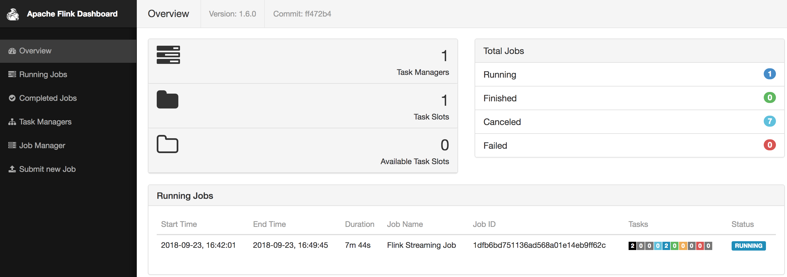

# flink-sessionization

## Description

A streaming pipeline using Apache Flink to process an input visitor clickstream from Kafka and output
sessions back into Kafka. A session is terminated after 30 minutes of inactivity, but we flush incomplete
sessions every minute to support real-time analysis on event data. Session state is maintained using
RocksDB which is natively supported by Flink.

## Running Locally

- Install Kafka  
  `brew install kafka`
- Run Kafka and Zookeeper  
  `zookeeper-server-start /usr/local/etc/kafka/zookeeper.properties & kafka-server-start /usr/local/etc/kafka/server.properties`
- Install Flink  
  `brew install apache-flink`
- Run the Flink cluster  
  `/usr/local/Cellar/apache-flink/1.6.0/libexec/bin/start-cluster.sh`
- Build a shadowJar  
  `./gradlew shadowJar`
- Start the Sessionization streaming job  
  `flink run -c com.vigneshraja.sessionization.Sessionization ./build/libs/flink-sessionization-all.jar`
- Verify the job is running with the [Flink dashboard](http://localhost:8081/#/overview)
  
- Use the [GenerateEvents](https://github.com/vraja2/flink-sessionization/blob/master/src/main/java/com/vigneshraja/sessionization/utils/GenerateEvents.java)
  utility to generate clickstream data into the Kafka input topic `raw-events`
- Run Kafka console consumer on the `sessionized-events` topic  
  `kafka-console-consumer --topic sessionized-events --bootstrap-server localhost:9092`

  Every minute, you will see open sessions being flushed to the `sessionized-events` topic. After 30 minutes of inactivity, you will see
  the sessions transition to `CLOSED`
  ```
  ...
  {"events":[{"timestamp":1537744379953,"userId":"userId14","eventType":"PAGE_VIEW"},{"timestamp":1537744865639,"userId":"userId14","eventType":"PAGE_VIEW"},{"timestamp":1537744868709,"userId":"userId14","eventType":"PAGE_VIEW"},{"timestamp":1537744871440,"userId":"userId14","eventType":"PAGE_VIEW"}],"lastEventTimestamp":1537744871440,"status":"CLOSED","id":"f0ba0425-5c48-43c1-ac6a-c994731b6753"}
  ...
  ```